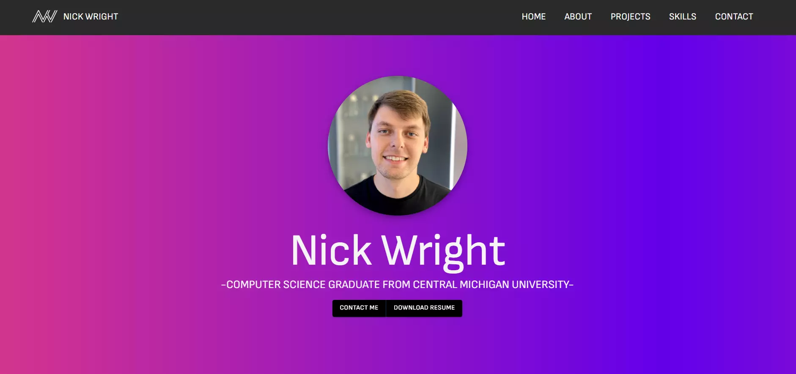

<a name="readme-top"></a>

<div align="center">

# Portfolio Website

Personal portfolio for **Nick Wright** - software developer at United Wholesale Mortgage.

[](https://github.com/wrigh4d/portwebsite/stargazers)
[](https://github.com/wrigh4d/portwebsite/issues)
[](https://www.linkedin.com/in/nick-wright12/)

[View the site](https://www.nwrightport.com) · [Report a bug](https://github.com/wrigh4d/portwebsite/issues) · [Request a feature](https://github.com/wrigh4d/portwebsite/issues)



</div>

## About

A single-page React site covering who I am, the projects I've built, my skills and
experience, and a contact form. It's a continuous project that I update as new work
ships.

**Built with:** React 18 (Create React App), MUI, styled-components, Framer Motion,
Swiper and EmailJS.

## Getting started

```bash
git clone https://github.com/wrigh4d/portwebsite.git
cd portwebsite
npm install
npm start
```

The dev server runs at <http://localhost:3000>.

### Environment variables

The contact form uses EmailJS. Defaults are compiled in, but you can override them:

```bash
cp .env.example .env.local
```

| Variable                          | Description                     |
| --------------------------------- | ------------------------------- |
| `REACT_APP_EMAILJS_SERVICE_ID`    | EmailJS service identifier      |
| `REACT_APP_EMAILJS_TEMPLATE_ID`   | EmailJS template identifier     |
| `REACT_APP_EMAILJS_PUBLIC_KEY`    | EmailJS public (browser) key    |

These are browser-visible values, not secrets.

### Scripts

| Command         | Description                            |
| --------------- | -------------------------------------- |
| `npm start`     | Start the development server           |
| `npm run build` | Produce a production build in `build/` |

## Project structure

```
public/            Static assets, HTML shell, manifest, robots.txt
src/
  theme.js         Single source of truth for the MUI theme + design tokens
  index.css        CSS custom properties, resets and global styles
  data/            Content data (projects)
  components/      One component per section, plus shared Section wrapper
  images/          Images (webp) and résumé PDF
```

### Theming

All colour, radius and spacing values live in two places that stay in sync:

- `src/index.css` - CSS custom properties used by styled-components.
- `src/theme.js` - the MUI theme (`tokens` export mirrors the CSS variables).

Components never hardcode colours; they reference `var(--token)` or the MUI palette.

## Roadmap

- [ ] Add a blog section with project write-ups
- [ ] Add more projects
- [ ] Migrate off the deprecated `react-scripts` toolchain (Vite)
- [ ] Add light-mode support

See the [open issues](https://github.com/wrigh4d/portwebsite/issues) for the full list.

## Contact

Nick Wright - <wrigh4d@cmich.edu> · [nwrightport.com](https://www.nwrightport.com)

<p align="right">(<a href="#readme-top">back to top</a>)</p>
